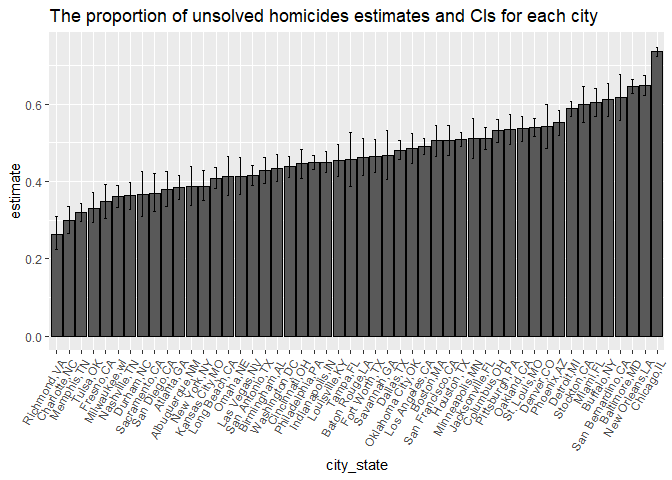

HW5
================
yh3429
2022-11-16

## Problem 2

``` r
library (tidyverse)
library (readxl)
library(rvest)
```

##### The raw data

``` r
raw_df = read_csv("./data/homicide-data.csv") 
```

    ## Rows: 52179 Columns: 12
    ## ── Column specification ────────────────────────────────────────────────────────
    ## Delimiter: ","
    ## chr (9): uid, victim_last, victim_first, victim_race, victim_age, victim_sex...
    ## dbl (3): reported_date, lat, lon
    ## 
    ## ℹ Use `spec()` to retrieve the full column specification for this data.
    ## ℹ Specify the column types or set `show_col_types = FALSE` to quiet this message.

There are 52,179 observations and 12 variables in the raw dataset. And
the key variables include `city`, `state`, `dispostion`, and so on.

##### Create a `city_state` variable

##### Calculate the number of total homicides and unsolved homicides

``` r
homicide_df = raw_df %>%
  janitor::clean_names() %>% 
  mutate (city_state = str_c (city, ",", state)) %>% 
  mutate (city_state = recode(city_state, "Tulsa,AL" = "Tulsa,OK"))
 

homicide_sum= homicide_df %>% 
  group_by (city_state) %>% 
  summarize ( 
    total_homicides = n (),
    unsolved_homicides = sum(disposition == "Closed without arrest" , disposition== "Open/No arrest"))

homicide_sum 
```

    ## # A tibble: 50 × 3
    ##    city_state     total_homicides unsolved_homicides
    ##    <chr>                    <int>              <int>
    ##  1 Albuquerque,NM             378                146
    ##  2 Atlanta,GA                 973                373
    ##  3 Baltimore,MD              2827               1825
    ##  4 Baton Rouge,LA             424                196
    ##  5 Birmingham,AL              800                347
    ##  6 Boston,MA                  614                310
    ##  7 Buffalo,NY                 521                319
    ##  8 Charlotte,NC               687                206
    ##  9 Chicago,IL                5535               4073
    ## 10 Cincinnati,OH              694                309
    ## # … with 40 more rows

##### For the city of Baltimore, estimated proportion and CI

``` r
balt_df =
  homicide_sum %>% filter (city_state == "Baltimore,MD") 
  
balt_prop =
 prop.test(x =   balt_df %>%  pull(unsolved_homicides), 
           n =   balt_df %>% pull(total_homicides), 
          alternative = c("two.sided"),
          conf.level = 0.95, correct = TRUE) %>% 
 broom::tidy() %>% select (estimate, conf.low, conf.high)

balt_prop
```

    ## # A tibble: 1 × 3
    ##   estimate conf.low conf.high
    ##      <dbl>    <dbl>     <dbl>
    ## 1    0.646    0.628     0.663

##### For each of cities

``` r
each_city_prop =
  homicide_sum  %>% 
  mutate( prop_test = 
            map2(.x = unsolved_homicides, 
                 .y = total_homicides, ~prop.test(x = .x, n= .y)),
         prop_tidy = map(.x = prop_test, ~broom::tidy(.x))) %>% 
  select (city_state, prop_tidy) %>% 
  unnest(prop_tidy) %>% 
  select (city_state, estimate, conf.low, conf.high)
```

##### A plot showing the estimates and CIs for each city

``` r
each_city_prop %>% 
  mutate(city_state= fct_reorder(city_state, estimate)) %>% 
   ggplot (aes (x=city_state, y=estimate))+
  geom_bar(stat="identity", color = "black",
           position=position_dodge())+ 
   labs(title = "The proportion of unsolved homicides estimates and CIs for each city") +
  theme(axis.text.x = element_text(angle = 60, hjust = 1))+
  geom_errorbar(aes(ymin=conf.low, ymax=conf.high), width=.2,
                 position=position_dodge(.9))
```

<!-- -->
