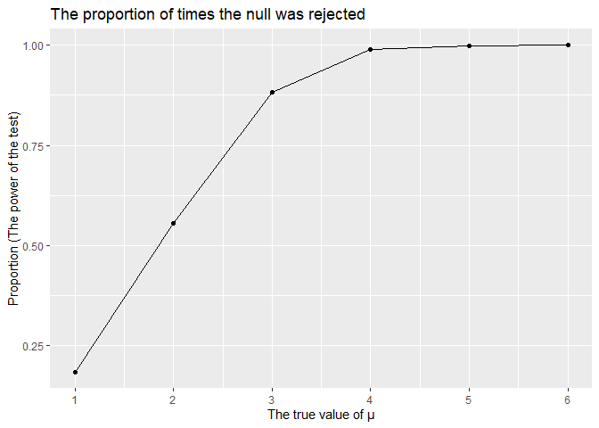
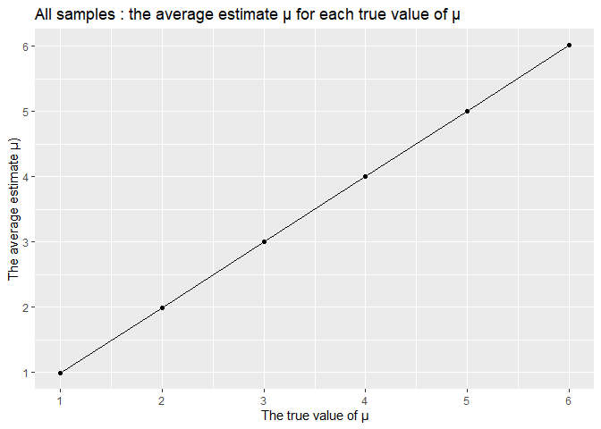
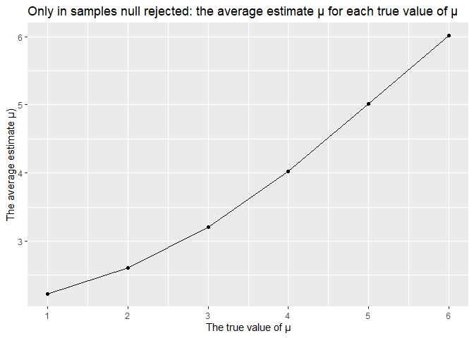
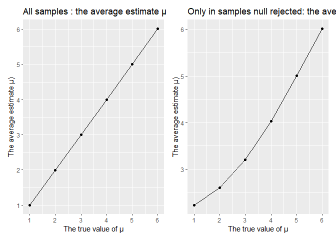

HW5
================
yh3429
2022-11-16

## Problem 2

``` r
library (tidyverse)
library (readxl)
library(rvest)
library(patchwork)
```

##### The raw data

``` r
raw_df = read_csv("./data/homicide-data.csv") 
```

    ## Rows: 52179 Columns: 12
    ## ── Column specification ────────────────────────────────────────────────────────
    ## Delimiter: ","
    ## chr (9): uid, victim_last, victim_first, victim_race, victim_age, victim_sex...
    ## dbl (3): reported_date, lat, lon
    ## 
    ## ℹ Use `spec()` to retrieve the full column specification for this data.
    ## ℹ Specify the column types or set `show_col_types = FALSE` to quiet this message.

There are 52,179 observations and 12 variables in the raw dataset. And
the key variables include `city`, `state`, `dispostion`, and so on.

##### Create a `city_state` variable

##### Calculate the number of total homicides and unsolved homicides

``` r
homicide_df = raw_df %>%
  janitor::clean_names() %>% 
  mutate (city_state = str_c (city, ",", state)) %>% 
  mutate (city_state = recode(city_state, "Tulsa,AL" = "Tulsa,OK"))
 

homicide_sum= homicide_df %>% 
  group_by (city_state) %>% 
  summarize ( 
    total_homicides = n (),
    unsolved_homicides = sum(disposition == "Closed without arrest" , disposition== "Open/No arrest"))

homicide_sum 
```

    ## # A tibble: 50 × 3
    ##    city_state     total_homicides unsolved_homicides
    ##    <chr>                    <int>              <int>
    ##  1 Albuquerque,NM             378                146
    ##  2 Atlanta,GA                 973                373
    ##  3 Baltimore,MD              2827               1825
    ##  4 Baton Rouge,LA             424                196
    ##  5 Birmingham,AL              800                347
    ##  6 Boston,MA                  614                310
    ##  7 Buffalo,NY                 521                319
    ##  8 Charlotte,NC               687                206
    ##  9 Chicago,IL                5535               4073
    ## 10 Cincinnati,OH              694                309
    ## # … with 40 more rows

##### For the city of Baltimore, estimated proportion and CI

``` r
balt_df =
  homicide_sum %>% filter (city_state == "Baltimore,MD") 
  
balt_prop =
 prop.test(x =   balt_df %>%  pull(unsolved_homicides), 
           n =   balt_df %>% pull(total_homicides), 
          alternative = c("two.sided"),
          conf.level = 0.95, correct = TRUE) %>% 
 broom::tidy() %>% select (estimate, conf.low, conf.high)

balt_prop
```

    ## # A tibble: 1 × 3
    ##   estimate conf.low conf.high
    ##      <dbl>    <dbl>     <dbl>
    ## 1    0.646    0.628     0.663

##### For each of cities

``` r
each_city_prop =
  homicide_sum  %>% 
  mutate( prop_test = 
            map2(.x = unsolved_homicides, 
                 .y = total_homicides, ~prop.test(x = .x, n= .y)),
         prop_tidy = map(.x = prop_test, ~broom::tidy(.x))) %>% 
  select (city_state, prop_tidy) %>% 
  unnest(prop_tidy) %>% 
  select (city_state, estimate, conf.low, conf.high)
```

##### A plot showing the estimates and CIs for each city

``` r
each_city_prop %>% 
  mutate(city_state= fct_reorder(city_state, estimate)) %>% 
   ggplot (aes (x=city_state, y=estimate))+
  geom_bar(stat="identity", color = "black",
           position=position_dodge())+ 
   labs(title = "The proportion of unsolved homicides estimates and CIs for each city") +
  theme(axis.text.x = element_text(angle = 60, hjust = 1))+
  geom_errorbar(aes(ymin=conf.low, ymax=conf.high), width=.2,
                 position=position_dodge(.9))
```

<!-- -->

## Problem 3

##### Create a function

``` r
sim_t_test = function (n=30, mu, sigma=5){
  
  sim_data = tibble(
    x= rnorm(n, mean=mu, sd=sigma),
  )
  
  sim_data %>% 
    t.test() %>% 
    broom::tidy() %>% 
    select (estimate, p.value)
}
```

##### when mu=0

``` r
sim_results_0 = 
  expand.grid(
    set_mu =0,
    iter=1:5000
  ) %>% 
  mutate(
    estimate_df = map (.x=set_mu, ~sim_t_test(mu=.x))
  ) %>% unnest(estimate_df)
```

##### when mu={1,2,3,4,5,6}

``` r
sim_results_all = 
  expand.grid(
    set_mu =c(1,2,3,4,5,6),
    iter=1:5000
  ) %>% 
  mutate(
    estimate_df = map (.x=set_mu, ~sim_t_test(mu=.x))
  ) %>% unnest(estimate_df)
```

##### Make a plot showing the proportion of times the null was rejected

``` r
rejected_null_pl =
  sim_results_all %>% 
  group_by(set_mu) %>% 
  summarise(total_times =n(),
             rejected_times = sum(p.value<0.05)) %>% 
  mutate (proportion= rejected_times/total_times) %>% 
  ggplot(aes(x = set_mu, y = proportion)) +
  geom_point() +
  geom_line()  +
  scale_x_continuous( breaks = 1:6 )+
  labs(title = "The proportion of times the null was rejected",
       y = "Proportion (The power of the test)",
       x = "The true value of μ") 

rejected_null_pl
```

<!-- -->

Description: According to the plot, when the true μ increases, the
proportion of times the null was rejected (the power of the test) also
increases. The larger effect size, the larger power. And the power of
the test will increase closely to 1.

##### Make a plot: showing the average estimate of μ-hat on the y axis and the true value of μ on the x axis

``` r
esti_mu_plot =
  sim_results_all %>% 
  group_by(set_mu) %>% 
  mutate (aver_esti = mean(estimate)) %>% 
  ggplot (aes(x=set_mu, y=aver_esti))+
  geom_point()+
  geom_line()+
  scale_x_continuous( breaks = 1:6 )+
   scale_y_continuous( breaks = 1:6 )+
  labs(title = "All samples : the average estimate μ for each true value of μ",
       y = "The average estimate μ)",
       x = "The true value of μ")

esti_mu_plot
```

<!-- -->

##### Make a second plot: the average estimate of μ-hat only in samples for which the null was rejected on the y axis and the true value of μ on the x axis

``` r
  esti_mu_plot2 =
  sim_results_all %>% 
  group_by(set_mu) %>% 
  filter (p.value<0.05) %>% 
  mutate (aver_esti = mean(estimate)) %>% 
  ggplot (aes(x=set_mu, y=aver_esti))+
  geom_point()+
  geom_line()+
  scale_x_continuous( breaks = 1:6 )+
  scale_y_continuous( breaks = 1:6 )+
  labs(title = "Only in samples null rejected: the average estimate μ for each true value of μ",
       y = "The average estimate μ)",
       x = "The true value of μ")

  esti_mu_plot2
```

<!-- -->

##### Juxtapose two plots

``` r
esti_mu_plot + esti_mu_plot2
```

<!-- -->

Description: The sample average of μ-hat across tests for which the null
is rejected approximately is not always equal to the true value of μ.
When the true value of μ from 1-4, the average estimate μ-hat is bigger
than the true value of μ. When the true value of μ from 4-6, the average
estimate μ-hat is approximately equal the true value of μ. The reason is
the smaller the true value of μ with smaller power. Without enough
bigger effect size and power,the average estimate of μ (for which the
null is rejected) does not equal to the true mean.
